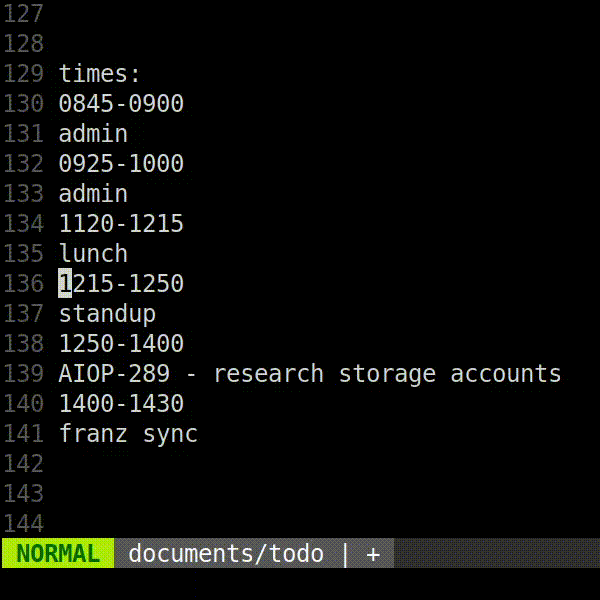
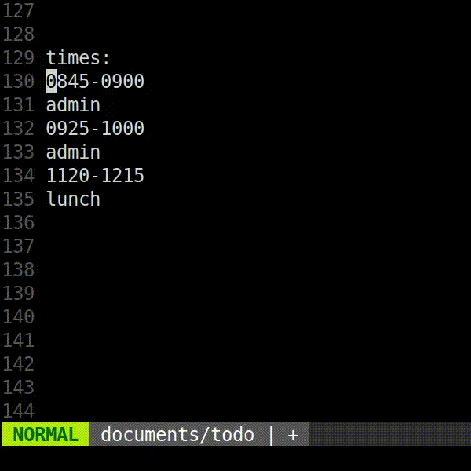

# JiraTime


[](https://coveralls.io/github/smlx/jiratime?branch=main)


`jiratime` makes it easy to submit timesheets to Jira quickly from the command line.
It is designed for use with timesheets logged in (neo)vim.

## Get it

Download the latest [release](https://github.com/smlx/jiratime/releases) on github, or:

```
go install github.com/smlx/jiratime/cmd/jiratime@latest
```

## How it works

### Configuration

`jiratime` reads configuration from `$XDG_CONFIG_HOME/jiratime/config.yml`.
Here's an example `config.yml` with a list of regular expressions for implicitly identifying issues, and another which will cause the timesheet entry to be ignored.
If a regular expression has a capture group it will be trimmed of spaces and hyphens and added to the comment body.

```
issues:
- id: XYZ-1
  defaultComment: email / slack / timesheets
  regexes:
  - ^admin( .+)?$
- id: ABC-2
  defaultComment: Primary On-call
  regexes:
  - ^pd$
ignore:
- ^lunch$
```

### Timesheet format

The timesheet format is minimal and opinionated.
Here's a full timesheet example, and a description of the major features.

```
0900-0945
admin - TPS report cover sheet
0945-1100
XYZ-123 - fighting fires
1100-1200
admin
1200-1300
lunch
1300-1400
ABC-987
- more meetings after...
lunch
1400-1430
ABC-988
will the meetings
ever stop?
```

#### Features

Timesheet entries are converted to Jira worklog records.
Each begins with a duration written as a time range in 24-hour format.

```
0900-0945
admin - TPS report cover sheet
```

The comment body of a timesheet entry is anything on the first line following an issue match, and any lines below before the next duration or end of the timesheet.

Regular expressions for implicitly identifying issues may have a capture group.
In that case the capture group becomes part of the comment body.

Comment lines are trimmed of spaces and hyphens and added to the comment body.

```
0900-0945
admin - TPS report cover sheet
0945-1100
XYZ-123 - fighting fires
1300-1400
ABC-987
- more meetings after...
lunch
```

Jira issues may be identified explicitly by putting the name of the issue at the start of the first line of the comment body.

```
0945-1100
XYZ-123 - fighting fires
1400-1430
ABC-988
will the meetings
ever stop?
```

Jira issues may be identified implicitly by matching the first line against a configured regular expression (see Configuration below).

```
0900-0945
admin - TPS report cover sheet
```

Timesheet entries may be ignored by matching the first line against a configured regular expression (see Configuration below).

```
1200-1300
lunch
```

Implicitly matched issues can have a default comment configured which will be automatically added to the Jira worklog record if no comment is defined in the timesheet.

```
1100-1200
admin
```

### Philosophy

`jiratime` tries hard to submit timesheets atomically.
That is, either all worklog records are submitted, or none are.
It does this by checking that all issues identified are valid Jira issues before submitting any worklogs.

`jiratime` exits with a return code of zero and no output on success.
On failure it will exit with a non-zero return code and a message on standard error.

## Usage

### Authorization Setup

`jiratime` authenticates to Jira as an OAuth2, client.
This requires a one-time initial setup.

#### Configure `jiratime` app in Jira cloud

1. Visit Atlassian's developer console here, and log in: https://developer.atlassian.com/console/myapps/
2. Create a new "OAuth 2.0 integration".
3. Name the app `jiratime`, and agree to Atlassians's T&Cs.

##### Scopes

1. Select "Permissions", then "Add" and "Configure" the "Jira platform REST API".
2. The "View user profiles" scope will already be added. Add the "View Jira issue data" and "Create and manage issues" scopes too.

##### Authorization callback URL

1. Select "Authorization", then "Configure" the "OAuth 2.0 (3LO)" authorization type.
2. Set the callback URL to `http://localhost:8080/oauth/redirect`

##### Gather app Credentials

1. Select "Settings".
2. In "Authentication details", copy the "Client ID" and "Secret" values.

#### Complete OAuth2 authorization flow

Create `$XDG_CONFIG_HOME/jiratime/auth.yml` and add your app credentials:

```
oauth2:
  clientID: chiYahchob7xoThahvohH5quae6Di0Ee
  secret: HxHOiN3bD5l93X3qugp9bHI8EKEJ7xVV4vcj6tG3vr7GFqxtxruMrkLcgtZAOPrZ
```

Run `jiratime authorize` and open the generated URL in your browser.
Once you click "Accept", you should see this message in your browser:

```
Authorization successful. You may now close this page.
```

`$XDG_CONFIG_HOME/jiratime/auth.yml` now contains a token that `jiratime` will use and automatically refresh as requred.

### Timesheet submission

Once configured and authorized, with no command specified or with `submit` specified `jiratime` performs timesheet submission by reading from standard input.

Command line:

```
$ jiratime < timesheet
```

`vim` visual selection:



```
:'<,'>!jiratime
```

`vim` line selection:



```
:130,135!jiratime
```

## Options

Run `jiratime help` to discover the command line options and contextual help.
